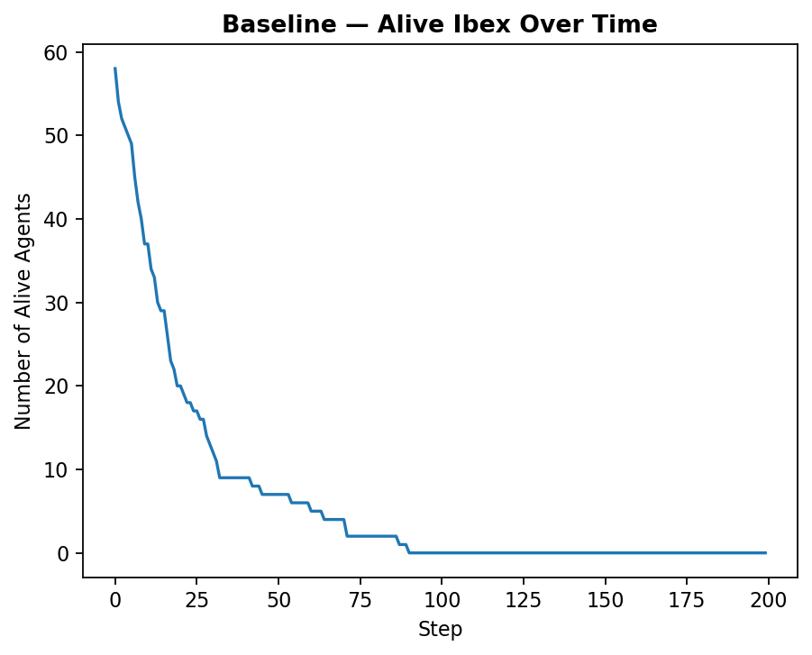
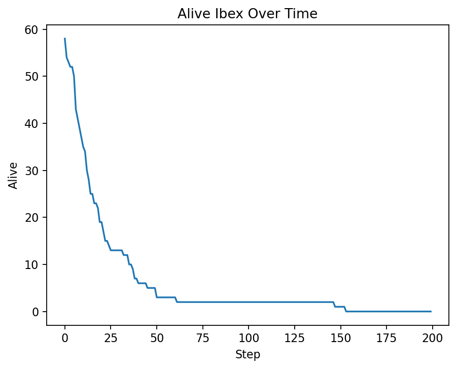
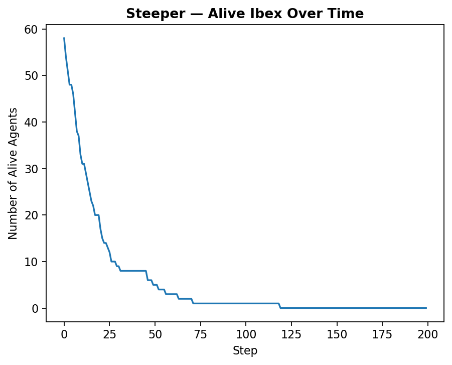

# Alpine Ibex Agent-Based Model (CITS4403 Project)

> The University of Western Australia — CITS4403: Computational Modelling  
> Semester 2, 2025  
> Authors: Farahnaz Abdi & Meryl Wang(Qiumei Wang) 

---
## Overview
This project simulates the **foraging and survival behaviour** of *Alpine Ibex* under different environmental conditions.

The model explores how variations in **salt availability** and **terrain slope** affect the population’s survival rate and movement distribution over time.

It was developed as part of the **Computational Modelling** unit (CITS4403), demonstrating an agent-based approach to ecological simulation.

---

## Project Structure
```
alpine_ibex_model/
├─ data/                     ← Stores input and output data
│  ├─ terrain.npy            # Terrain elevation map (generated)
│  ├─ salt_points.csv        # Salt source coordinates
│  ├─ results_baseline.csv   # Simulation output for baseline
│  ├─ results_low_salt.csv   # Simulation output for low salt
│  └─ results_steeper.csv    # Simulation output for steeper terrain
│
├─ figures/                  ← Automatically generated figures
│  ├─ pop_baseline.png
│  ├─ pop_low_salt.png
│  ├─ pop_steeper.png
│  ├─ heatmap_baseline.png
│  ├─ heatmap_low_salt.png
│  └─ heatmap_steeper.png
│
├─ src/                      ← Core source code
│  ├─ agents.py              # Defines ibex agents and behaviour
│  ├─ model.py               # Simulation model setup
│  ├─ environment.py         # Terrain & environment loader
│  └─ experiments.py         # Scenario execution logic
│
├─ utils/
│  ├─ calculations.py        # Core numerical computations
│  └─ visualization.py       # Plot heatmaps and population trends
│
├─ notebooks/
│  └─ Alpine_ibex.ipynb   # Main Jupyter Notebook
│
├─ requirements.txt          # Python dependencies
└─ README.md                 # Describes the Alpine Ibex agent-based model and how to run the simulation
```

---

## Installation
### 1️. Clone the repository
```bash
git clone https://github.com/farahnazabdi92/alpine_ibex_model.git
cd alpine_ibex_model
```

### 2️. Install dependencies
```bash
pip install -r requirements.txt
```

---

## Running the Simulation

You can run everything directly from the Jupyter Notebook:

```bash
jupyter notebook notebooks/Alpine_ibex.ipynb
```

Each scenario (Baseline, Low Salt, Steeper Terrain) will automatically generate:

- CSV result files in `/data/`
- Figures in `/figures/`

---

## Visualization & Outputs

The notebook dynamically displays:
- Alive Ibex over time (line plots)
- Spatial heatmaps of Ibex movement
- Scenario-wise summaries

Example results:
| Scenario | Description | Figure |
|-----------|--------------|---------|
| Baseline | Normal terrain and salt |  |
| Low Salt | 50% fewer salt points |  |
| Steeper Terrain | 30% higher slope |  |

---

## Model Parameters

| Parameter | Description | Default |
|------------|--------------|----------|
| `n_agents` | Number of Ibex agents | 60 |
| `time_steps` | Simulation duration | 200 |
| `salt_modifier` | Salt availability | 1.0, 0.5 |
| `slope_modifier` | Terrain steepness | 1.0, 1.2 |
| `seed` | Random seed for reproducibility | 42 |

---

## Collaboration Workflow

We used **GitHub branches and pull requests** for teamwork:
- `main` branch — final integrated version  
- `merylwang` branch — Meryl’s commits (visualization, terrain, notebook)  
- `Farahnaz` branch — Farah’s commits (agent logic, model behaviour)  
- Each round corresponds to a documented PR with commit messages and descriptions

Example PRs:
- **Farahnaz model.py : Implement IbexModel core structure and simulation logic**
- **Merylwang – Visualization module implementation**

---

## Key Learnings

- Designed and tested a full **agent-based ecological model**  
- Implemented multi-scenario analysis with parameter variation  
- Automated visual reporting and data collection  
- Practiced collaborative Git workflows using branches, commits, and PRs  

---

## Requirements

Python ≥ 3.10  
Libraries:
```
numpy
pandas
matplotlib
scipy
jupyter
seaborn
```

---

## Authors

| Name | Role | Contributions |
|------|------|----------------|
| **Meryl Wang** | Visualization, Notebook Integration | environment, experiments |
| **Farahnaz Abdi** | model, agents | calculations, report |

---

## References

- Article: Biancardi, C. M., & Minetti, A. E. (2017). Gradient limits and safety factor of Alpine ibex (Capra ibex) locomotion. Hystrix, the Italian Journal of Mammalogy, 28(1). https://doi.org/10.4404/hystrix-28.1-11504 
- UWA CITS4403 Course Materials  

---

## Status
**Final Submission — October 2025**  
All modules and notebook outputs verified successfully.

```
Simulation completed  
Figures generated  
PRs merged  
Ready for submission
```
